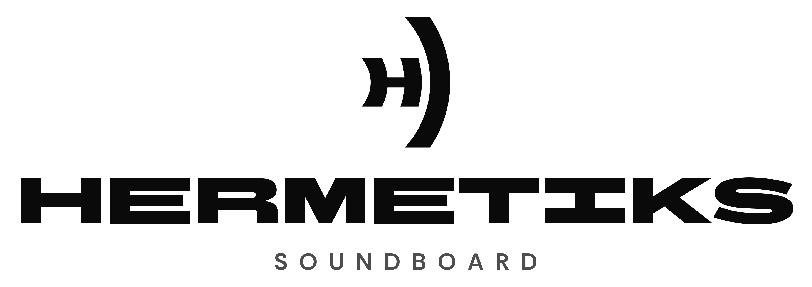

Lightweight numpad soundboard for Windows. Trigger radio clips, phrases and effects with global hotkeys while
you play; the audio mixes into your sound output like Spotify or Chrome does.
Free and open source (MIT). Interface in **English, Español, 中文 and Português**.

*Created and developed by [Orilla Estudio Creativo](https://hermetiks.orilladiseno.cl), part of HERMETIKS COLLECTIVE, Chile.*

## Features
- **Global hotkeys by scancode**: work while a game has focus, with NumLock on or off. Any key can be assigned.
- **Output you choose** (WASAPI, low latency) plus an optional monitor. Pick `CABLE Input` ([VB-CABLE](https://vb-audio.com/Cable/)) as the output so friends hear it in voice chat.
- **Per-key sound design**: volume, speed/pitch, trim with waveform, bass/treble, echo, reverb, old radio, robot, reverse, normalize.
- **Modes**: normal, hold-to-play, loop.
- **Duck**: lowers Spotify (or any app you list) while a clip plays, then restores it.
- **Profiles**: a bank of sounds per game, radio or stream.
- **Import** files (wav, mp3, ogg, flac, opus, m4a...), direct links or YouTube.
- System tray, start with Windows, optional key blocking for the game.

## Install
Download `Hermetiks-Setup-x.y.z.exe` (or the portable zip) from the website or the GitHub Releases page and verify
it against `SHA256SUMS.txt` (see [SECURITY.md](SECURITY.md)). The installer needs no administrator rights.

## Run from source
    py -m pip install -e .[dev]
    py -m hermetiks
    py -m pytest

## Build the release
    py tools/build.py        # dist/: installer, portable zip, SHA256SUMS.txt

More in [docs/ARCHITECTURE.md](docs/ARCHITECTURE.md), [docs/DISTRIBUTION.md](docs/DISTRIBUTION.md) and [CONTRIBUTING.md](CONTRIBUTING.md).

## Legal
Code: [MIT](LICENSE). Name, wordmark and pictogram: [TRADEMARKS.md](TRADEMARKS.md).
Privacy: [PRIVACY.md](PRIVACY.md). Third-party licenses: [THIRD_PARTY_NOTICES.md](THIRD_PARTY_NOTICES.md).
Fonts: BBH Bartle and Rethink Sans under the SIL Open Font License 1.1.
